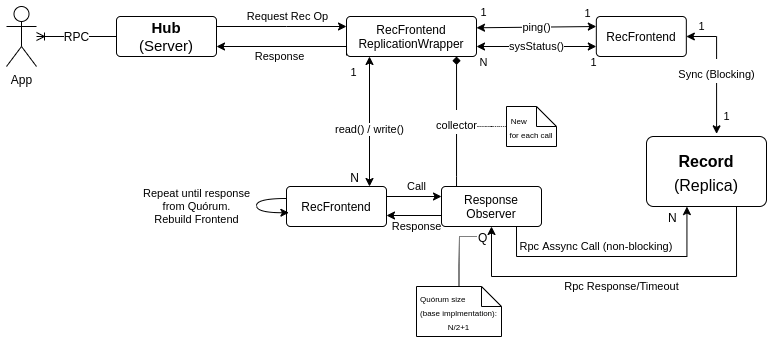
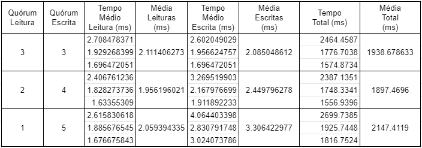

# Relatório do projeto *Bicloin*

Sistemas Distribuídos 2020-2021, segundo semestre

## Autores

**Grupo A24**

| Número | Nome               | Utilizador                                     | Correio eletrónico                  |
| --------|-------------------|------------------------------------------------| ------------------------------------|
| 92437  | Catarina Gonçalves | <https://git.rnl.tecnico.ulisboa.pt/ist192437> | <mailto:catarina.g.goncalves@tecnico.ulisboa.pt>   |
| 92456  | Duarte Bento       | <https://git.rnl.tecnico.ulisboa.pt/ist192456> | <mailto:duarte.bento@tecnico.ulisboa.pt>     |
| 92560  | Susana Monteiro    | <https://git.rnl.tecnico.ulisboa.pt/ist192560> | <mailto:s.moreno.monteiro@tecnico.ulisboa.pt> |

  

## Melhorias da primeira parte

- [Melhorias no guia de demonstração](https://git.rnl.tecnico.ulisboa.pt/SD-20-21-2/A24-Bicloin/commit/5b432fcd693fd06ddbf1deb0aa0d0c5b785404d7) (teste dos comandos)

- [Correção de um comando na App](https://git.rnl.tecnico.ulisboa.pt/SD-20-21-2/A24-Bicloin/commit/6d1499e2a40c538249c7c59e3881e78e7ee9fb78) - adição do link para o google maps no comando `at`

- [Usar utf-8 encoding na leitura dos ficheiros de dados (causava problemas com testes)](https://git.rnl.tecnico.ulisboa.pt/SD-20-21-2/A24-Bicloin/commit/7c8c9f3741915883587edff6ebd9ab886545fafb)

## Modelo de faltas

Sendo a nossa implementação baseada num protocolo de registo distribuído coerente, adotou-se um modelo de faltas semelhante ao deste protocolo. Assim assume-se que:
- o sistema é assíncrono (tanto a comunicação como o processamento podem demorar um tempo arbitrário)
- a comunicação é fiável (as mensagens são sempre recebidas desde que nem o cliente nem o servidor falhem), mas a ordem de chegada das mensagens não é necessariamente igual à ordem de envio das mesmas
- podem ocorrer faltas silenciosas/crash, mas nunca faltas bizantinas
- as faltas das réplicas do `rec` são transientes e não definitivas
- o `hub` não falha durante o processamento de procedimentos remotos, não deixando operações inacabadas 
- o conjunto de réplicas é estático (conhecido *a priori*), ainda que os seus endereços possam variar ao longo do tempo

Assim, na nossa implementação base são toleradas *f* faltas silenciosas/crash quando o grau de replicação é *2f+1*. Após as otimizações este número é diferente para as operações de leitura e de escrita, sendo referido e explicado [aqui](#opções-de-implementação).

As faltas bizantinas/arbitrárias não são toleradas. Também não se tolera faltas no `hub` nem no `ZooKeeper`. 

## Solução

Como referido, a nossa implementação base tolera *f* faltas silenciosas/crash quando o grau de replicação é *2f+1*. Isto acontece porque tanto nas operações de escrita como de leitura, é necessário obter apenas resposta de um quórum de réplicas (de tamanho *f+1*). Quando o número destas faltas ultrapassa o *f*, a chamada remota não poderá ser concluída com sucesso, caso contrário a coerência sequencial seria prejudicada. Assim, se tal acontecer, o nosso `hub` apercebe-se disso e consulta o ZooKeeper para verificar se houve mudança do *ip* e/ou *port* de uma ou mais réplicas e tenta executar a operação de novo. Isto repetir-se-à até que a operação seja concluída (ou até que o `hub` seja terminado pelo utilizador).

## Protocolo de replicação

_(Explicação do protocolo)_
Segue-se uma abordagem de replicação ativa, implementando uma variante do protocolo registo distribuído coerente para coordenar as leituras e escritas concorrentes nas réplicas.

Cada réplica guarda o valor do registo e uma tag composta por um seqNumber (número de sequência da escrita que deu origem à versão) e um clientID (identificador do cliente que escreveu essa versão). Uma tag é mais recente do que outra se o seu seqNumber for maior ou, caso os seqNumber sejam iguais, se o seu clientID for maior. É de notar que, devido ao `hub` não ser replicado, o clientID é sempre o mesmo. No entanto, a nossa implementação tem em conta o clientID prevendo uma futura possibilidade de replicar o `hub`.

Para que a coerência sequencial seja garantida, a nossa versão base conta com um quórum de *f+1* réplicas, tanto para escritas como para leituras (sendo *f* o número de faltas silenciosas toleradas). Desta forma, garante-se que os quóruns de escrita e de leitura têm pelo menos uma réplica em comum.

Para o `hub` não ficar bloqueado à espera de uma resposta específica do rec, as chamadas remotas são assíncronas. Isto é feito com recurso a um stub não bloqueante. Sendo assim, na chamada é passado um objeto do tipo `StreamObserver`, o `ResponseObserver`, que se comporta por um lado como um **ResponseCollector** permitindo receber os resultados da chamada e ao mesmo tempo, como **objeto de callback** que é chamado quando se recebe uma resposta utilizando os métodos onNext, onError e onCompleted. 

Em relação à possibilidade de fazer um *writeback*, ainda que o `hub` seja um servidor gRPC *multi-threaded*, este é sincrozinado não permitindo que haja duas operações (escritas ou leituras) concorrentes no mesmo registo. Como se assume que o `hub` não falha durante o processamento de pedidos remotos, então não há operações inacabadas - nunca se dá o caso de uma escrita ter sido feita apenas num número de réplicas inferior ao quórum e portanto duas leituras seguidas nunca serão incoerentes.  Deste modo, a operação de *writeback* proposta no protocolo de registo coerente não é necessária na nossa implementação. 

Na implementação base, os *quóruns*, tanto de escrita como de leitura têm um valor igual (*N/2+1*). Após as medições de desempenho e análise de resultados, observamos que uma operação de leitura tem uma frequência absoluta consideravelmente superior à de escrita (cerca de *2/3*) e que conseguiriamos tirar partido de uma variante do protocolo com *quóruns* de escrita e leitura com pesos variáveis, neste caso diminuindo o peso para uma leitura, optimizando esta à custa das escritas. Na secção [opções-de-implementação](#opções-de-implementação) aprofundamos este conceito, principalmente a escolha para o valores de **Threshold** para cada uma das operações.

### Leituras
- Cliente (Hub)
    1. Cliente envia um `read()` para todas as réplicas.
    2. Aguarda pelas respostas dos servidores. Aqui podem ocorrer várias situações:
        - É recebida uma exceção lógica (por exemplo, os argumentos enviados no pedido serem inválidos). Neste caso, o stream observer notifica imediatamente a *thread* principal para que o erro seja reportado. Como as verificações feitas pelas réplicas são todas iguais, assume-se que nenhuma réplica terá executado a operação. 
        - Foi obtido um quórum de respostas bem-sucedidas ou uma resposta/erro de todas as réplicas. Em qualquer um dos casos, se foi obtido pelo menos um erro de comunicação com os servidores (`UNAVAILABLE` por não ter sido possível comunicar com esse servidor ou `DEADLINE_EXCEEDED` por ter ocorrido um *timeout* antes de uma resposta ter sido recebida) é chamada a função `rebuildReplicas()`. Esta função consiste em solicitar ao *ZooKeeper* os endereços de todas as réplicas conhecidas (através da função `lookUp(replica_path)`). Independentemente de ser ou não preciso chamar a função `rebuildReplicas()`, podem ocorrer dois casos:
            - Um quórum de pelo menos *f+1* respostas foi atingido e a operação dá-se por terminada
            - O número de erros é demasiado grande, não se tendo atingido um quórum. Neste caso é necessário repetir a operação de leitura (voltar ao ponto 1).
    3. Retorna o valor que recebeu associado à maior tag.

- Réplica (Rec)
    1. Cada réplica ao receber um `read()` confirma que os argumentos são válidos. Se sim, responde com o valor do registo e a tag. Se não, envia uma exceção.

### Escritas
- Cliente (Hub)
    1. Cliente faz uma leitura a todas as réplicas para descobrir a maior tag (ver [leituras](#leituras))
    2. Cria uma nova tag com o *maxSeqNumber + 1* e o seu *clientID*.
    3. Envia um `write()` com o valor do registo e a nova tag a todas as réplicas.
    4. Espera por resposta de confirmação de um quórum (ou volta a repetir a operação até que tal aconteça). Aqui podem ocorrer os casos semelhantes ao ponto **2** das leituras do Cliente (Hub), visto que a classe `StreamObserver` é a mesma.
    5. Retorna confirmação ao cliente

- Réplica (Rec)
    1. Recebe um `write()` com um valor e uma tag.
    2. Confirma se os argumentos da mensagem de pedido são corretos. Em caso afirmativo, prossegue. Em caso negativo, retorna uma exceção e não conclui a operação.
    3. Se a tag recebida for maior (*newSeqNum* > *oldSeqNum* ou *newSeqNum* == *oldSeqNum* && *newCID* > *oldCID*), atualiza o valor do registo e da tag com os recebidos.
    4. Quer tenha ou não atualizado o valor, responde com uma confirmação. 

## Medições de desempenho

Por observação do código foi possível gerar a seguinte tabela, que mostra o número de escritas e leituras por cada operação.

| operação | leituras | escritas |
|----------|----------|----------|
| balance | 1 | 0 |
| top-up | 2 | 1 |
| info-station | 4 | 0 |
| locate-station | 0 | 0 |
| bike-up | 8 | 4 |
| bike-down | 8 | 4 |
| **Total** | 23 | 9 |

Além disso, num comando `scan X` da App são feitas `X` leituras para zero escritas.

Observa-se portanto que fazendo um número igual de operações de cada tipo, o número de leituras é bastante superior ao número de escritas. É então esperado que diminuir o quórum de leituras leve a um aumento da performance, ainda que para isso seja necessário aumentar o número de escritas.

Para confirmar esta hipótese e otimizar o código, foram feitas algumas medições utilizando-se:
- um hub, que não corre com a opção initRec;
- 5 réplicas do Rec (todas up), inicializadas anteriormente;
- uma app, que corre o ficheiro `demo/commandsPerformance.txt`. Este ficheiro tem um conjunto de operações repetido várias vezes, sendo este conjunto constituído por todas as operações disponiveis (1 operação de cada)
 
No total são feitas 712 leituras (77,56%) e 206 escritas (22,44%). Como o número de leituras é muito superior ao número de escritas, é esperado que diminuir o quórum de leituras leve a um aumento da performance, ainda que para isso seja necessário aumentar o número de escritas. Portanto foram feitas medições nesse sentido, estando resumidas na tabela abaixo:

> Embora esta tabela seja um resumo das medições obtidas, os valores completos podem ser consultados nos ficheiros [3 leituras/3 escritas](3_3quoruns.txt), [2 leituras/4 escritas](2_4quoruns.txt) e [1 leitura/5 escritas](1_5quoruns.txt)

É de esperar que correndo o mesmo teste com um maior conjunto de réplicas levaria a uma maior discrepância de valores entre os vários quóruns. Porém, considerou-se que 5 réplicas do Rec era um número razoável e que permite já observar que um meio termo entre ter quóruns iguais e ter um *write threshold* máximo parece ser melhor hipótese.

## Opções de implementação

Para implementar as chamadas remotas assíncronas era necessário criar um StreamObserver e um ResponseCollector. Como já foi apontado anteriormente, optou-se por criar uma única classe, chamada `ResponseObserver` que reúne as qualidades de objeto de callback e de armazenamento das respostas das várias réplicas. Cada operação usa a mesma instância para todas as réplicas, guardando nesta toda a informação. 

Foi adotada esta opção visto que, além de ter sido a primeira ideia do grupo, implica ter menos uma classe e apenas 1 objeto por cada leitura/escrita (em vez dos *2f+1* StreamObservers e *1* ResponseCollector necessários na outra opção). A opção adotada implica um maior investimento na coerência mas, sendo esta bem feita, permite obter os mesmos resultados. 

Em relação às melhorias, verificou-se que o número de leituras é muito superior ao número de escritas. Isto significa que ter um quórum menor para as operações de leitura permitiria que a nossa implementação fosse mais eficiente. Portanto, otimizando uma operação à custa da outra permite ter muitas operações de leituras baratas (mais rápidas) e poucas operações de escrita mais caras (mais lentas). 
Escolhemos um **ReadThreshold** de **N/3 + 1** para as leituras (em proporção com a frequência desta operação (2/3)) e por consequência **N - ReadThreshold + 1** para as escritas (de modo a manter uma réplica em comum)  É no entanto de notar que isto implica que as operações de escrita já não toleram *f* faltas mas antes *N - WriteThreshold* faltas (visto que é agora preciso obter resposta de *N - ReadThreshold + 1* réplicas). Já as operações de leitura passam a tolerar *N - ReadThreshold* faltas (visto que são precisas apenas *N/3 + 1* respostas para se atingir o quórum). Por exemplo, para 5 réplicas o `ReadThreshold = 2`, `WriteThreshold = 4` e, consequentemente, o número de falhas toleradas é `3` numa leitura e `1` numa escrita.

No limite, poderíamos ter um **WriteThreshold** máximo e, portanto, precisar apenas da resposta de uma única réplica ao fazer uma leitura. Porém, não só a operação de escrita poderia ficar muito pesada como a nossa implementação passaria a não suportar falhas nas operações de escrita.

## Notas finais

É de notar que o número de réplicas inicial do `rec` nunca pode ser *zero*. Para impedir esta situação, o `hub` não começará a sua execução enquanto não encontrar pelo menos uma réplica do `rec` registada no ZooKeeper. Isto é verdade tanto para o número de `recs` como para o número de `hubs` pelo que, da mesma forma, a App não começará a sua execução enquanto não encontrar nenhum `hub` registado no ZooKeeper.